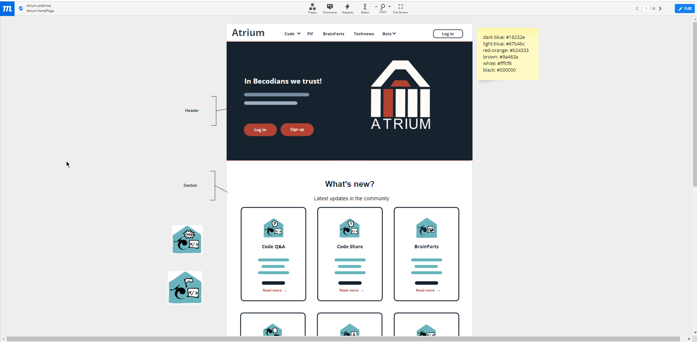

## About Becode.Org
>Becode.Org is a non profit organization with headquarters in Brussels, Belgium, that provides qualitative, competitive and inclusive coding bootcamps, accessible to all.
Learn more at:
> - 

# About Atrium

>It was created within the context of a final project by team "DeadPool" from Class YU-4 of Becode campus Ghent.
Atrium is a social platform to unify BeCodians. It came from the desire of connecting all Becode Campus in one unique platform and bridge the gap that Discord can't.
Therefor Atrium allows each becodian be it a student, coah or staff, to get in touch with their peers from other campuses. 
We gave the platform several categories for different purposes. In the area CodeQ&A for example, the user can ask questions, help or ask for feedback related to their code, and in the area Bots, users can share ideas for our beloved "alarm button".

>It is meant to unify becode students globally, but it is also a learning tool. A tool to be constantly improved and worked upon (within BeCode rules of course ;) ).
It was such an ambitious project, that we new perfectly that 4 weeks (the time given in "Kingsize project" exercise) was not enough to build all we had envisioned, so we leave this project open to future Becodians to pick it up and build from where we left.
Atrium is therefor open-source. We build it with Laravel-Breeze on the back end and ReactJS on the front end.

>So, get in touch with your fellow BeCodians and push that button! For in BeCodians we trust!

## Table of Contents
- [Features](#Features)
- [Languages](#Languages)
- [Technologies](#Technologies)
- [Editor](#Editor)
- [Learning](#learning)
- [WIP](#WIP)
- [bugs](#Bugs)
- [Team](#Team)
- [License](#license)

# Features

> Platform is public but only registerd users can participate

### Acomplished so far:
- Login and Register
- Posts section CRUD actions: publish posts, comment, edit and delete
- User Profile CRUD actions:
    - edit your name and email
    - change you password.
- Forum styled pages for code, pay-it-forward, technews, and memejokes called BrainFarts

### Desired future features:
 - Adding pictures to users Profile
 - WUSIWYG editor for post and comments
 - Acessibility darkmode
 - Ability to share pictures or videos

# Languages

 - 
 - 
 - 
 - 
 - 

# Technologies

 - 
 - 
 - 
 - 
 - 
 - 

# Editor
- 

# Version control
- 

# Resources
- 
- 
- 
- 
- 
- 

# Design
>We used app.moqups.com to develop all our wireframes

>

## WIP
> - The Bots page and its subsquente functionalities still need to be developed. Right now is only a static page.
> - When changing the password, an error or success message still needs to be prompt to the user, for them to know if there action was accomplished or not.

## Bugs & errors

### Pagination:
>We are using REACT-PAGINATE pacakge component.
####  - Faulty behaviour
>When content is less than 5 posts per category it does not distribute posts per page properly.
navigation between each pagination button works, but does not show 3 posts per page persistently.
In some cases posts only show when after the 2 tab/button.

# Team - Deadpool

| <h4>Franciska Dendooven</h4> | <h4>Madalena Rio</h4> | <h4>Gladys Haelters</h4> |
| :---: |:---:| :---:|
|       |       |       |
| <a href="https://github.com/FranciskaDendooven" target="_blank">`github.com/FranciskaDendooven`</a> | <a href="https://github.com/madalenaRio" target="_blank">`github.com/madalenaRio`</a> | <a href="https://github.com/Gladyshaelters" target="_blank">`github.com/Gladyshaelters`</a> |

## License
- Copyright 2022 © Atrium - by Team Deadpool

