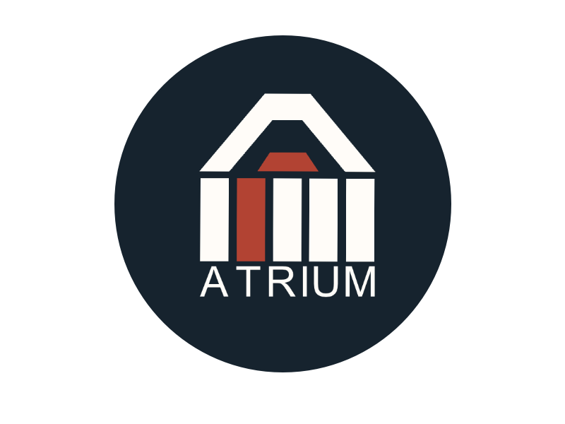

## About Atrium

Atrium is a social platform to unify BeCodians. The platform allows the user to get in touch with their peers and other coaches. The platform has several pages for different purposes. In the CodeQ&A for example, the user can ask questions, help or ask for feedback related to their code.

Atrium is build with Laravel-Breeze, ReactJS and is open-source based for BeCodians. The platform is meant to unify the students globally, but it is also a learning tool. A tool to be constantly improved and worked upon (within BeCode rules of course ;) ).

So, get in touch with your fellow BeCodians and push that button! For in BeCodians we trust!

## Table of Contents
- [Features](#Features)
- [Languages](#Languages)
- [Technologies](#Technologies)
- [Editor](#Editor)
- [Learning](#learning)
- [WIP](#WIP)
- [bugs](#Bugs)
- [Team](#Team)
- [License](#license)

## Features

> Platform is viewable by everyone

> interactions: comment, post, edit and delete are only possible when registered

> Forum thread styled pages for code, pay-it-forwerd, technews, and memejokes called BrainFarts

## Languages

still need to add PHP

## Technologies

STILL NEED TO FIND AD BADGE FOR INERTIA AND BREEZE

## Editor
editor

## Learning
 > About Resource

[documentation](https://laravel.com/docs)

add laracast? or all documentation that we used and worked from trello???

## Design
link to mockup

ADD link to our Mockup and maybe a img

## WIP

## Bugs 

## Team

| <h4>Franciska Dendoven</h4> | <h4>Madalena Rio</h4> | <h4>Gladys Haelters</h4> |
| :---: |:---:| :---:|
|       |       |       |
| <a href="https://github.com/FranciskaDendooven" target="_blank">`github.com/FranciskaDendooven`</a> | <a href="https://github.com/madalenaRio" target="_blank">`github.com/madalenaRio`</a> | <a href="https://github.com/Gladyshaelters" target="_blank">`github.com/Gladyshaelters`</a> |

## License
- Copyright 2022 © Atrium - bygit a Team Deadpool

